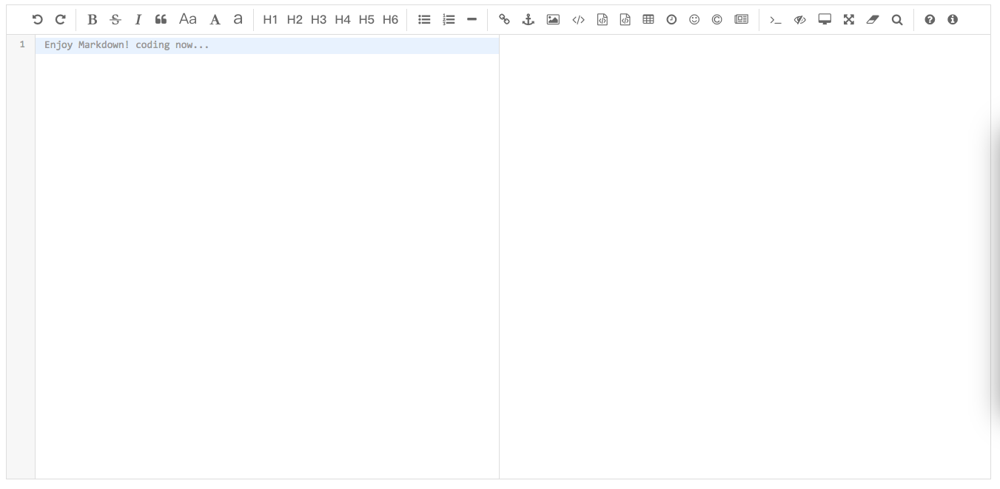

## Django MKEditor
A form widget that change the textfield style to the markdown.



## Installation
1. Get the code: `pip install mkeditor`
2. Add `mkedirot` to your `INSTALLED_APPS`


## Usage
1. In forms.py

```
	from mkeditor.widgets import MarkdownWidget
	
	class ArticleForm(forms.ModelForm):
		class Meta:
		widgets = {
            'content': MarkdownWidget, # the content is model field 
        }
```

2. In admin.py

```
from .form import ArticleForm

class ArticleAdmin(admin.ModelAdmin):
    form = ArticleForm

admin.site.register(Article, ArticleAdmin)
```